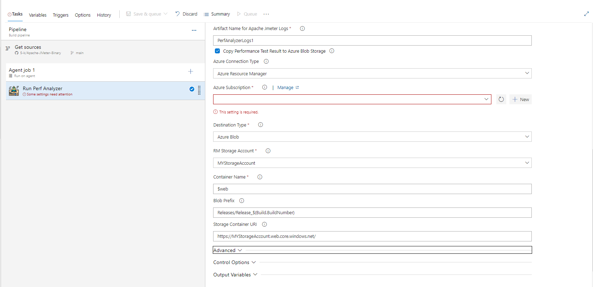

## About the Project
This is an Azure DevOps Extension to Run Performance Test using Apache JMeter and Analyze Results.

This task enables to run Performance testing using Apache JMeter, Analyze report and post results.

This task uses Apache JMeter 5.5 (can be modified) and expects a valid parametrized JMX File, Any input Files, and property file for JMX. The task runs the jmx files according to the configured values in JMX and uses property file and parametrizes it with the variables listed in pipeline variables. You can additionally use any number of user input files based on your test and mention them in property file for use.

The pipeline task downloads your JMX, Property File, Input files and then runs the JMeter task and publishes the result to build pipeline artifacts.

You can additionally host the data on a web URL by using the Static Website hosting capacity of Azure storage account. The task publishes the results to your $web container of your storage container.
You need to enable static hosting in the storage container in order to be able to view html results. These results are published and ready for view immediately after test result. The link of hosted website is available in the logs.

## Market Place

You can get the task [HERE](https://marketplace.visualstudio.com/items?itemName=id-az-pipeline.jmeter-perf-analyzer)

## Latest Updates

#### V1.5.44
- Enabled Custom Plugin Jars to be copied to JMeter's lib/ext folder
- Allowed input files to be copied without need to provide property file

#### V1.3.80
- Fixed Issue for Storage Account Binding Name. Updated Readme's.

#### V1.2.57
- Enabled Log analysis for JMeter. Pipeline can be marked as failed if failure count increase threshold specified.

#### V1.1.55
- Stable Version.

## Demo


## Architecture


## Features

- Run Apache JMeter Performance Tests
- Produces Results for Analysis by publishing it to artifacts.
- Uploads results to Azure Storage account using Static Store for viewing results through a online link.
- Cross platform - Can be integrated along with any project
- Can be used as a regression/integration test in build pipeline to ensure use-cases pass per PR Request
- Can be used to tune and optimize performance based on the analysis.
- Can Fail task if the JMeter results any failure. This would help in continuous integration test to identify any breaking change. Integrating this in build pipeline would help identify any breaking change before merge to main.


## Tech Stack

**Client:** Typescript, JavaScript

**Server:** Node, Azure ARM Template, Azure Storage


## Screenshots


## Sample Usage

Follow this Link: [SAMPLE USAGE](https://github.com/microsoft/jmeter-performance-analyzer-devops-extension/blob/main/samples/README.md)

Follow this Link: [YAML TASK BASED INPUT](https://github.com/microsoft/jmeter-performance-analyzer-devops-extension/blob/main/InputTaskYAML.md)

Follow this Link: [CLASSIC PIPELINE GUI BASED TASK BASED INPUT](https://github.com/microsoft/jmeter-performance-analyzer-devops-extension/blob/main/InputTask.md)

## Installation To your Pipeline

1. Install the extension from Market Place: [HERE](https://marketplace.visualstudio.com/items?itemName=id-az-pipeline.jmeter-perf-analyzer)


2. Search for the extension in your pipeline task

3. Add the task


4. Provide input to variables




5. Trigger the Pipeline


6. Verify Pipeline artifacts results and html report. Html Reports as artifacts are supported only on Build Pipelines. For release pipeline you can host them on Azure Storage.


## Pipeline Variables

The following variables are used in the pipeline. Some have default values which can be updated.

`JMX Run File Source` : This provides you the option to provide your JMX Source. It can be either from the source code of the pipeline or it can be a direct external URL. This is set to default to SourceCode

`JMX Run File Source Path`: This is the path of the JMX source code file. You can select the file path and update the input here. This is visible in case you select 'SourceCode' in the `JMX RUN File Source` step.

`JMX Run File Source URL` : This provides you the option to provide your JMX Source File via a direct external URL. A https URL is expected here. This file will be downloaded from the link and used as JMX file source to run the test.

`JMX Property File Source` : This provides you the option to provide your JMeter Property File Source. It can be none (in case your jmx does not require a property file to run), source code of the pipeline or it can be a direct external URL. This is set to default to SourceCode

`JMX Property Source Path`: This is the path of the JMeter Property source code file. You can select the file path and update the input here. This is visible in case you select 'SourceCode' in the `JMX Property File Source` step.

`JMeter Property Source URL` : This provides you the option to provide your JMeter Property File via a direct external URL. A https URL is expected here. This file will be downloaded from the link and used as JMX Property file source to run the test.

`Token Regex"` : This provides you the option to specify the regex for replacing the tokens in property File to the values specified in pipeline variables. This is visible only if the JMX Property File source is not set to None. This regex must include a group match. The regex match should be return a group of 2 values, one with variable name second with variable and enclosure. Samples (Starts and ends with 1 underscore ==>  _(\\w+)_ ,Starts and ends with % ==>  %(\\w+)%)

`JMX Input File Source(s)"` : This provides you the option to provide your JMeter Input File Source. Your test might require some test data stored in CSV, XLS etc. This tasks enables to procure those files and makes it available to test. It can be none (in case your jmx does not require any input file to run), source code of the pipeline or it can be a direct external URL. This is set to default to None. This option is visible only if `JMX Property File Source` is not set to None.

`JMX Input Folder Source`: This is the path of the JMeter Input source code Folder. All files inside this folder will be made available to JMeter test. You should the file names mentioned here in the property file and use that variable in JMX. You can select the folder path and update the input here. This is visible in case you select 'SourceCode' in the `JMX Input File Source(s) Source` step.

`JMX Input File(s) Source URL Comma Separated` : This provides you the option to provide your JMeter Input File(s) via a direct external URL(s). You can specify multiple URLs comma separated. All files mentioned will be downloaded sequentially and made available to JMeter for test run. One or many, comma Separated, https URLs are expected here.

`Publish Logs and Test Results to Pipeline Artifacts`: This is a boolean flag that if set to true will publish the test results and logs to pipeline artifacts. This should not be enabled if this task is used in a release pipeline. This is default set to true and will yield the result on task completion.

`Artifact Name for Apache JMeter Reports`: This is the output artifact name for the test results. Only visible if the `Publish Logs and Test Results to Pipeline Artifacts` is set to true.

`Artifact Name for Apache JMeter Logs`: This is the output artifact name for the test logs. Only visible if the `Publish Logs and Test Results to Pipeline Artifacts` is set to true.

`Fail Task if JMeter test fails`: This would fail the pipeline task in case any test fails. This is useful if your use-case is to identify any regression failure due to new deployment. Enabling this in CICD would help you monitor failures in jmx by failing the task itself.

`Fail Task if test failure count is more than`: In case your JMeter test failure count is more than the number specified, then the pipeline will fail.

`Add Custom Plugin(jars) To Jmeter Lib/ext Folder`: This would allow you to copy your custom plugins to Jmeter Lib/Ext Folder. Might be used in custom implementation and 3rd Party jars used to run JMX

`Source Folder for Custom Plugins`: Source Type from where you want to copy custom plugins to JMeter's lib/ext folder.

`Folder Path For JMeter Plugins`: This is the path of the Plugins Input source code Folder. All files inside this folder will be made available to Jmeter via copying to ext folder. You can select the folder path and update the input here. This is visible in case you select 'SourceCode' in the `Source Folder for Custom Plugins` step.

`Custom Plugin File(s) Or Jar(s) Source URL Comma Separated`: This provides you the option to provide your Plugin File(s) via a direct external URL(s). You can specify multiple URLs comma separated. All files mentioned will be downloaded sequentially and made available to JMeter for test run via copying to ext folder. One or many, comma Separated, https URLs are expected here.This is visible in case you select 'urls' in the `Source Folder for Custom Plugins` step.

`Additional Command Line Arguments`: The arguments specified here will be appened to the Jmeter run command. The run script looks like jmeter -q {propertFileIfAny} -n -t {JMXFile}  -l {LogFile} {Your Arguments go here}. Hence this can be '-JUser=admin -dSomeProperty=Value'. Please note that this is appened as it is hence User must ensure correctness of the command.

`Copy Performance Test Result to Azure Blob Storage`: This is a boolean flag that if set to true enabling this would help to copy Apache JMeter's Performance Test Report, Log File and JTL File to be copied to Azure Blob Storage. Using Static website hosting turned on you can access any run report later as well via a direct link."

`ConnectedServiceNameSelector`: This is a picklist option to specify where to make azure connection. Currently this is set to Azure Resource Manager only.

`Azure Subscription`: This option lets you select the subscription in which you have created your storage container.

`Destination Type`: This is where your output result and logs would be copied to. Currently only Azure Blob Storage is supported.

`RM Storage Account`: This is the storage account name inside the above mentioned subscription. You need to `Enable Static Storage Hosting` option here and create a container named $web inside. For this container $web, you will need to change the access to publish in order to view html reports. You can either do this or create a CDN to expose data from here More details available here: https://docs.microsoft.com/en-us/azure/storage/blobs/storage-blob-static-website.

`Container Name`: This is the container name inside the storage account where your results and logs will be copied. This is defaulted to $web. Note that in case you want continuous reporting available on html webpage, keep it to $web only. Files in $web will be available to view as html files.

`Blob Prefix`: This is the prefix inside container name where each run's report will be copied. It is essential to note that for continuous integration and testing it's best to prefix it will build number. This way all continuous build's result will be made available at all times as a http exposed UTL. If used in Build pipeline, it can be `Releases/Release_DEV_$(Build.BuildNumber)`, if in release then it can be `Release_DEV_$(Release.ReleaseName)_$(Release.AttemptNumber)`

`Storage Container URI`: This is the Primary endpoint URI for your container. On Enabling static web hosting, this URL is made available. If not specified, the task will not be able to create a direct html link to the test results.

#### Advance Variables
These variables are available under the `advanced` section of the pipeline. These are default to some values and do not require change unless you want to customize it.

`JMeter Download URL`: This is the https link to JMeter binary. A TGZ binary file https URL is expected here. It is set to download 5.5 version of Apache JMeter by default.

`Extracted folder name for JMeter binary`: In case you modify the JMeter Download URL, to some other version then this variable also needs to change. This is the folder name of the JMeter binary file post extraction/unzip. Also update this if you modify the above jmeter url to the extracted folder name

`JMeter Custom Unzipped Folder Name`: In case you wish to unzip the Jmeter binary to a custom folder, you can update the path name here. This is useful if you want to have seperate Jmeter instances task in same pipeline.

`Add random suffix to JMeter Folders`: This would enable you to create a unique jmeter folder by adding a random suffix at the end of download folder. There are at time possibility that multiple task run in same pipeline and hence would overwrite each other by the end of the pipeline run. Enabling this will ensure each task in a pipeline run would execute smoothly.

`Add random suffix to JMeter Artifacts`: This would enable you to create a unique published folder(s) by adding a random suffix at the end of artifacts(log and report). There are at time possibility that multiple task run in same pipeline and hence would overwrite the logs and result of each other by the end of the pipeline run. Enabling this will ensure each task in a pipeline run would execute smoothly and generate build artifacts with unique names.

`JMeter Log Folder Name`: This is the name of Log folder that is created as a result of test run. This is defaulted to `CurrentLog_$(System.StageName)`. This is one of the artifacts that is later published as well.

`JMeter Report Folder Name"`: This is the name of Result folder that is created as a result of test run. This is defaulted to `CurrentReport_$(System.StageName)`. This is one of the artifacts that is later published as well.

`Telemetry Data Collection`: This flag enables the task to send telemetry data for improving the product over time. The task does not log any personal information. The task logs runs and errors for developers to analyze and provide a better version of the task. Turning this off would not allow the task to send logs to Microsoft.


## Run Locally

Clone the project

```bash
  git clone https://github.com/microsoft/jmeter-performance-analyzer-devops-extension
```

Go to the project directory task

```bash
  cd perfanalyzer
```

Install dependencies

```bash
  npm install
```

Compile the typescript file

```bash
  tsc index.ts
```

Run and debug locally using VS Code or Compiled Java-script file.


## Packaging

Once Compiled using tsc and the dependencies are downloaded using `npm i` you can package the project to create a `vsix`

Update the publisher name in vss-extension.json
```bash
  touch vss-extension.json
```

Package the dependecies

```bash
  npx tfx extension create --manifest-globs vss-extension.json
```

You might get an error with the following text

```bash
   Error: Part Name 'perfanalyzer/node_modules/azure-pipelines-tasks-azure-arm-rest-v2/openssl/OpenSSL License.txt'
```
This is because of one of the dependencies  from azure-pipelines-tasks-azure-arm-rest-v2. There is a file named OpenSSL License.txt. You need to remove
any blank space from this. Hence rename this file to OpenSSL_License.txt and rerun the command. You should get a successful output vsix file.

```bash
  === Completed operation: create extension ===
 - VSIX: C:\R\personal_projects\PerfAnalyzer\MishraPrateek.********-****-****-****-************-*.*.**.vsix
 - Extension ID: ********-****-****-****-************-*.*.**.vsix
 - Extension Version: 0.1.33
 - Publisher: MishraPrateek
```
You can now publish this extension to your own organization and share it with them.

Follow the link for more Update: [AZURE WEB Extension](https://docs.microsoft.com/en-us/azure/devops/extend/get-started/node?view=azure-devops)


## Note

### Data Collection.

The software may collect information about you and your use of the software and send it to Microsoft. Microsoft may use this information to provide services and improve our products and services. You may turn off the telemetry as described in the repository. There are also some features in the software that may enable you and Microsoft to collect data from users of your applications. If you use these features, you must comply with applicable law, including providing appropriate notices to users of your applications together with a copy of Microsoft’s privacy statement. Our privacy statement is located at https://go.microsoft.com/fwlink/?LinkID=824704. You can learn more about data collection and use in the help documentation and our privacy statement. Your use of the software operates as your consent to these practices.


## Contributing

This project welcomes contributions and suggestions.  Most contributions require you to agree to a
Contributor License Agreement (CLA) declaring that you have the right to, and actually do, grant us
the rights to use your contribution. For details, visit https://cla.opensource.microsoft.com.

When you submit a pull request, a CLA bot will automatically determine whether you need to provide
a CLA and decorate the PR appropriately (e.g., status check, comment). Simply follow the instructions
provided by the bot. You will only need to do this once across all repos using our CLA.

This project has adopted the [Microsoft Open Source Code of Conduct](https://opensource.microsoft.com/codeofconduct/).
For more information see the [Code of Conduct FAQ](https://opensource.microsoft.com/codeofconduct/faq/) or
contact [opencode@microsoft.com](mailto:opencode@microsoft.com) with any additional questions or comments.

## Trademarks

This project may contain trademarks or logos for projects, products, or services. Authorized use of Microsoft
trademarks or logos is subject to and must follow
[Microsoft's Trademark & Brand Guidelines](https://www.microsoft.com/en-us/legal/intellectualproperty/trademarks/usage/general).
Use of Microsoft trademarks or logos in modified versions of this project must not cause confusion or imply Microsoft sponsorship.
Any use of third-party trademarks or logos are subject to those third-party's policies.

# Support

## How to file issues and get help  

This project uses [GitHub Issues](https://github.com/microsoft/jmeter-performance-analyzer-devops-extension/issues) to track bugs and feature requests. Please search the existing
issues before filing new issues to avoid duplicates.  For new issues, file your bug or
feature request as a new Issue.

For help and questions about using this project, please create a Issue [Here](https://github.com/microsoft/jmeter-performance-analyzer-devops-extension/issues)

## Microsoft Support Policy  

Support for this **PROJECT or PRODUCT** is limited to the resources listed above.


## License

[MIT License](https://github.com/microsoft/jmeter-performance-analyzer-devops-extension/blob/main/LICENSE.txt)
