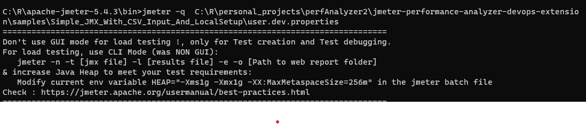
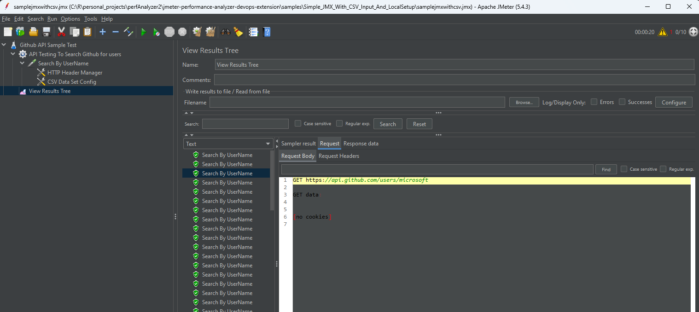
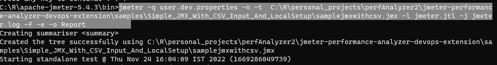
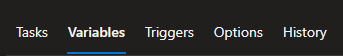
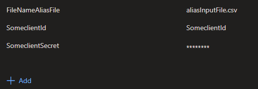
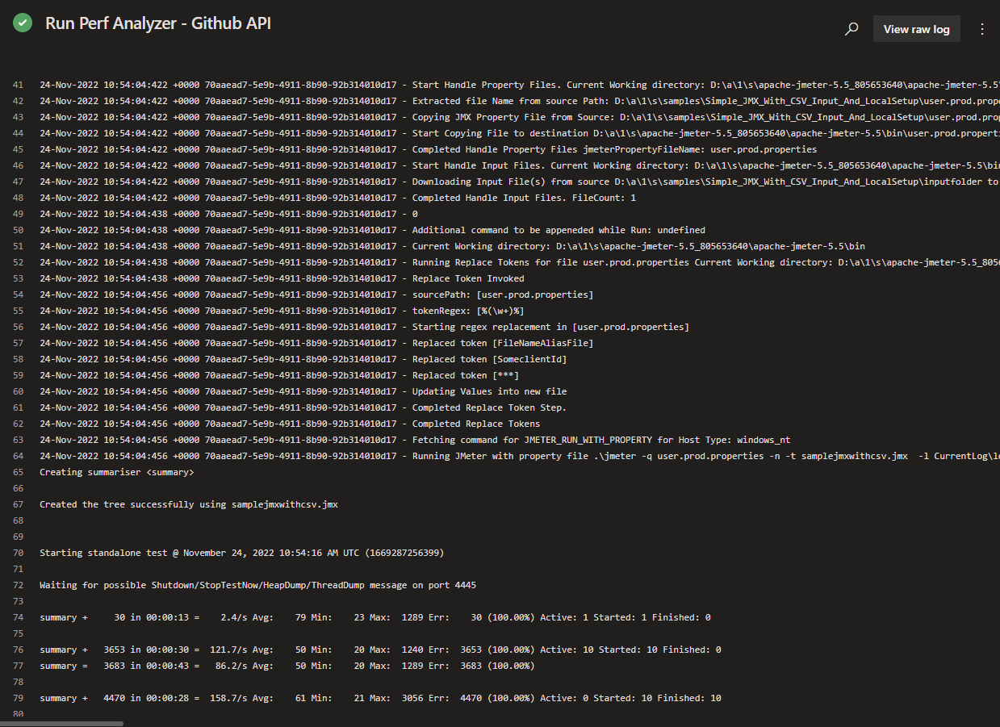

## Running the Task on your Pipeline

### For Local testing

1. Download Apache JMeter from [Here](https://dlcdn.apache.org//jmeter/binaries/apache-jmeter-5.5.tgz)

2. Unzip Apache JMeter on your machine.

3. Inside JMeter bin folder, copy the following:
    a. samplejmxwithcsv.jmx
    b. user.dev.properties

4. Once copied you can update the properties file, if needed.

5. Running Locally using GUI

    a. To open load test with property file in memory run
        ```jmeter -q user.dev.properties```

    

    b. This should open GUI and now you can open the jmx file `samplejmxwithcsv.jmx` from the bin folder.
    c. Click on run to see the data

    

6. Running Locally using non GUI

    a. Run the command
        ```jmeter -q user.dev.properties -n -t  samplejmx.jmx -l jmeter.jtl -j jmeter.log -f -e -o Report```
    
    

This is how you can run the task in yur local.

### For CICD JMeter Task testing

1. Add the Jmeter Task
2. Use the JMX file
3. Use the user.prod.properties

   
4. Provide value for
 a. FileNameAliasFile
 b. SomeclientId
 c. SomeclientSecret



 in the pipeline variables. The default regex is set to ```"%(\\w+)%"``` Hence this would replace anything between `% % ` 
5. Provide the input files
6. Run the pipeline.


