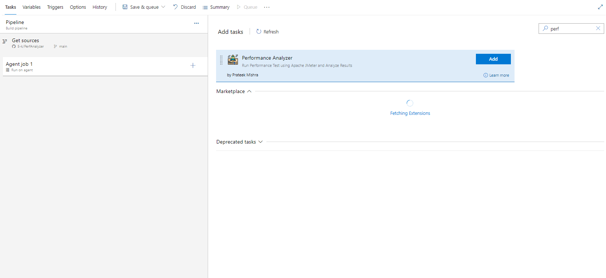

## Running the Task on your Pipeline

### For Local testing

1. Download Apache JMeter from [Here](https://dlcdn.apache.org//jmeter/binaries/apache-jmeter-5.5.tgz)

2. Unzip Apache JMeter on your machine.

3. Inside JMeter bin folder, copy the following:
    a. jmx_with_filled_data.properties
    b. sampleInputFile.csv
    c. samplejmx.jmx

4. Once copied you can update the properties file, if needed.

5. Running Locally using GUI

    a. To open load test with property file in memory run
        ```jmeter -q  jmx_with_filled_data.properties```
    b. This should open GUI and now you can open the jmx file `samplejmx.jmx` from the bin folder.
    c. Click on run to see the data

6. Running Locally using non GUI

    a. Run the command
        ```jmeter -q  jmx_with_filled_data.properties -n -t  samplejmx.jmx -l jmeter.jtl -j jmeter.log -f -e -o Report```


This is how you can run the task in yur local. You can create your own jmx and test it like this. Once done, create a paramerized version of property file like `jmx.properties` here. 

Now you can add the jmeter task in your pipeline, and provide the variable value in `Variables` section of your azure pipeline.


1. Search for the extension in your pipeline task



2. Provide input to variables


#### Note that for the format shared the Token Regex will be %(\w+)% This means enclosed within %Variable_Name%
Token Regex `%(\w+)%`

3. Save the pipeline and queue the run


You can see the pipeline has printed the results in the logs.


## Note 

To Enable Static Hosting you would to enable that in the Azure Storage Container

1. Under Storage Accounts > Your Storage Account >

Search for 'Static Website' from the search bar.

Click on Enable

Copy the Primary Endpoint URL from there

This is the value you need to submit in pipeline Variable for `Storage Container URI` variable in Pipeline Task


2. Under your storage account > Containers >

Create a new container named `$web`

If this container exists, skip this step.

3. Click on `Change Access Level`

4. Select Option

`Container(anonymous read access for container and blobs)`


## Sample Screenshots for Pipeline Variables for Source Code Inputs


## Sample Screenshots for Pipeline Variables for External URL Inputs


## Sample Screenshots for Pipeline Variables where no property file is used.


## Sample Screenshots for Pipeline Variables where  Property file is used but no input files are required

